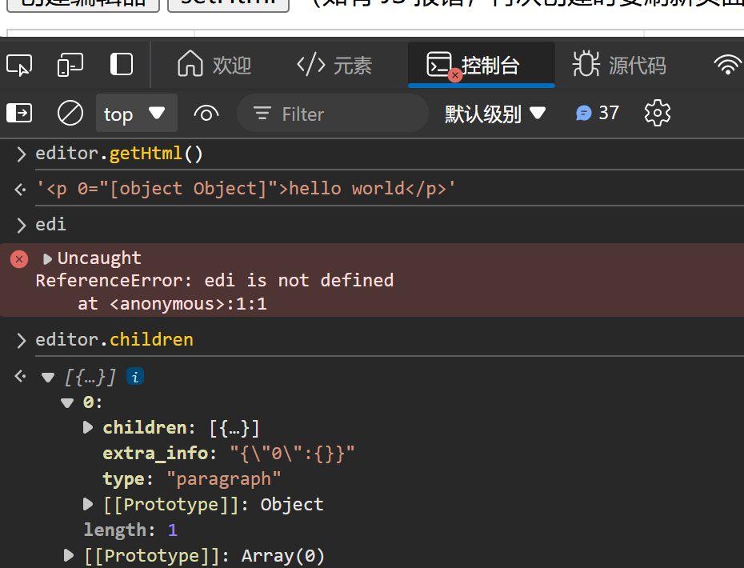

# wangEditor 5

[English](./README-en.md)

## 介绍

开源 Web 富文本编辑器，开箱即用，配置简单。支持 JS Vue React 。

- [文档](https://www.wangeditor.com/)
- [demo](https://www.wangeditor.com/demo/)

## 交流

- [讨论问题和建议](https://github.com/wangeditor-team/wangEditor/issues)

## 捐赠

支持 wangEditor 开源工作 https://opencollective.com/wangeditor

##

1. 使用 node < 17
2. 修改yarn.lock 中的的 无法获取的包https地址
3. lerna@7.0.0
4. 安装依赖 时异常解决，yarn config set "strict-ssl" false -g

1. 对于一个标签，如何指导 使用那个 node来渲染

render-elem.tsx  渲染元素到 编辑器中
elem-to-html.ts 生成富文本html 方法